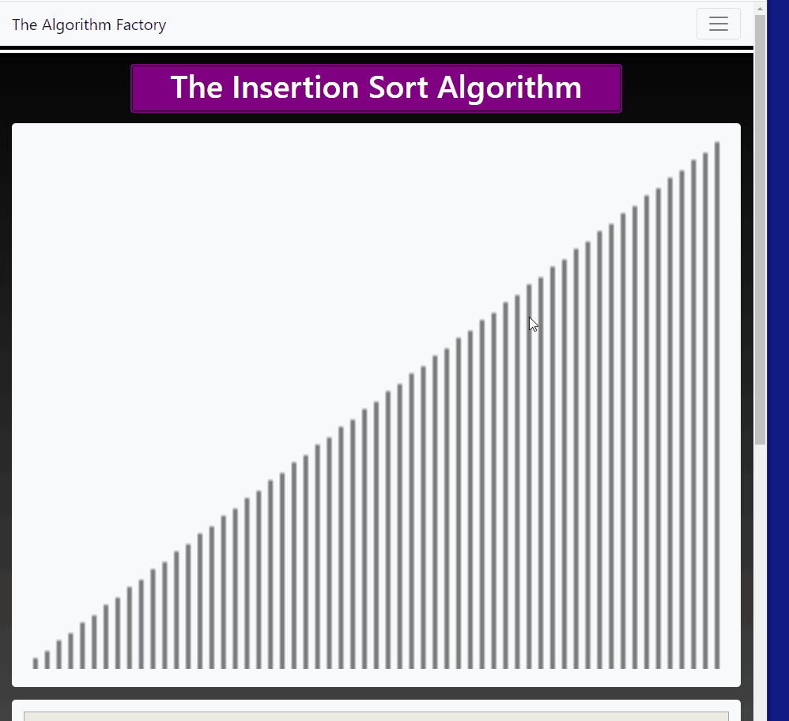

# The-Algorithm-Factory
A Website Created with Spring Boot to Visualize Sorting Algorithms.

This web app that incorporates Thymeleaf
https://www.thymeleaf.org/
as a templating engine.

It its a casestudy of a the Factory Design Pattern and will use a series of 
Sorting Algorithms implemented in Java.

Another implemenation of sorting animations (for comparison)
https://www.toptal.com/developers/sorting-algorithms

Using Bootstrap4, along with HTML5 & css3 It will be a visual representation of sorting algorithms 
and will allow the user to cycle through the offered Algorithms. 

Although Javascript is synchronous the use of setTimeout() within for loop
did not work as intended. This is because the setTimeout() function is in fact asynchronous.

https://www.freecodecamp.org/news/thrown-for-a-loop-understanding-for-loops-and-timeouts-in-javascript-558d8255d8a4/

Explains in further detail the 3 main components that work in conjunction with Javascript. 
i.e. The Call Stack, the Web Api's, and the Event Queue.
