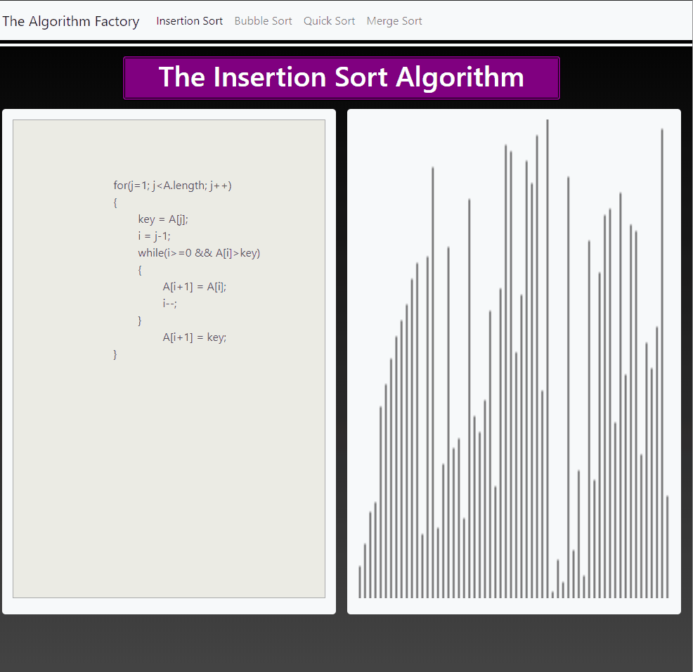

# The-Algorithm-Factory
A Website Created with Spring Boot to Visualize Sorting Algorithms.

This web app that incorporates Thymeleaf
https://www.thymeleaf.org/
as a templating engine.

It its a casestudy of a the Factory Design Pattern and will use a series of 
Sorting Algorithms implemented in Java.

Using Bootstrap4, along with HTML5 & css3 It will be a visual representation of sorting algorithms 
and will allow the user to cycle through the offered Algorithms. 

